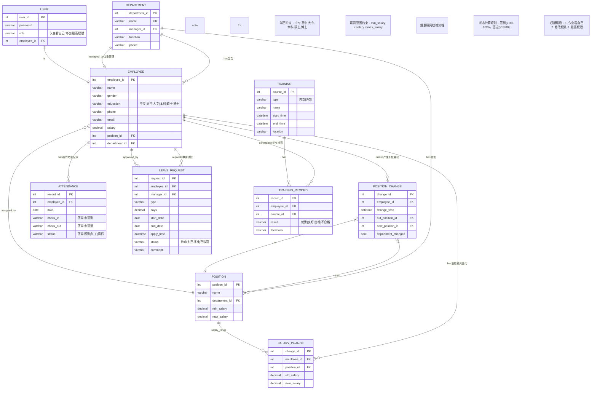

```mermaid
erDiagram
    %% 实体定义
    EMPLOYEE {
        int employee_id PK
        varchar name
        varchar gender
        varchar education "中专|高中|大专|本科|硕士|博士"
        varchar phone
        varchar email
        decimal salary
        int position_id FK
        int department_id FK
    }

    DEPARTMENT {
        int department_id PK
        varchar name UK
        int manager_id FK
        varchar function
        varchar phone
    }

    POSITION {
        int position_id PK
        varchar name
        int department_id FK
        decimal min_salary
        decimal max_salary
    }

    POSITION_CHANGE {
        int change_id PK
        int employee_id FK
        datetime change_time
        int old_position_id FK
        int new_position_id FK
        bool department_changed
    }

    SALARY_CHANGE {
        int change_id PK
        int employee_id FK
        int position_id FK
        decimal old_salary
        decimal new_salary
    }

    ATTENDANCE {
        int record_id PK
        int employee_id FK
        date date
        varchar check_in "正常|未签到"
        varchar check_out "正常|未签退"
        varchar status "正常|迟到|旷工|请假"
    }

    LEAVE_REQUEST {
        int request_id PK
        int employee_id FK
        int manager_id FK
        varchar type
        decimal days
        date start_date
        date end_date
        datetime apply_time
        varchar status "待审批|已批准|已驳回"
        varchar comment
    }

    TRAINING {
        int course_id PK
        varchar type "内部|外部"
        varchar name
        datetime start_time
        datetime end_time
        varchar location
    }

    TRAINING_RECORD {
        int record_id PK
        int employee_id FK
        int course_id FK
        varchar result "优秀|良好|合格|不合格"
        varchar feedback
    }

    USER {
        int user_id PK
        varchar password
        varchar role "仅查看自己|修改|最高权限"
        int employee_id FK
    }

    %% 关系定义
    EMPLOYEE ||--o{ POSITION_CHANGE : "makes产生职位变动"
    EMPLOYEE ||--o{ SALARY_CHANGE : "has拥有薪资变化"
    EMPLOYEE ||--o{ ATTENDANCE : "has拥有考勤记录"
    EMPLOYEE ||--o{ LEAVE_REQUEST : "requests申请请假"
    EMPLOYEE ||--o{ TRAINING_RECORD : "participates参与培训"

    DEPARTMENT ||--o{ EMPLOYEE : "has包含"
    DEPARTMENT ||--o{ POSITION : "has包含"
    DEPARTMENT ||--|| EMPLOYEE : "managed_by由谁管理"
    %% manager_id 指向 EMPLOYEE

    POSITION ||--o{ EMPLOYEE : "assigned_to"
    POSITION ||--o{ SALARY_CHANGE : "salary_range"
    POSITION_CHANGE }|--|| POSITION : "from"
    %% old_position_id
    POSITION_CHANGE }|--|| POSITION : "to"
    %% new_position_id

    TRAINING ||--o{ TRAINING_RECORD : "has"

    LEAVE_REQUEST }|--|| EMPLOYEE : "approved_by"
    %% manager_id

    USER ||--|| EMPLOYEE : "is"
    %% 用户与员工一一对应

    %% 业务规则注释
    note for EMPLOYEE "学历约束：中专,高中,大专,本科,硕士,博士"
    note for POSITION "薪资范围约束：min_salary ≤ salary ≤ max_salary"
    note for POSITION_CHANGE "触发薪资校验流程"
    note for ATTENDANCE "状态计算规则：签到(7:30-8:30)，签退(≥18:00)"
    note for USER "权限层级：1. 仅查看自己 2. 修改权限 3. 最高权限"
```