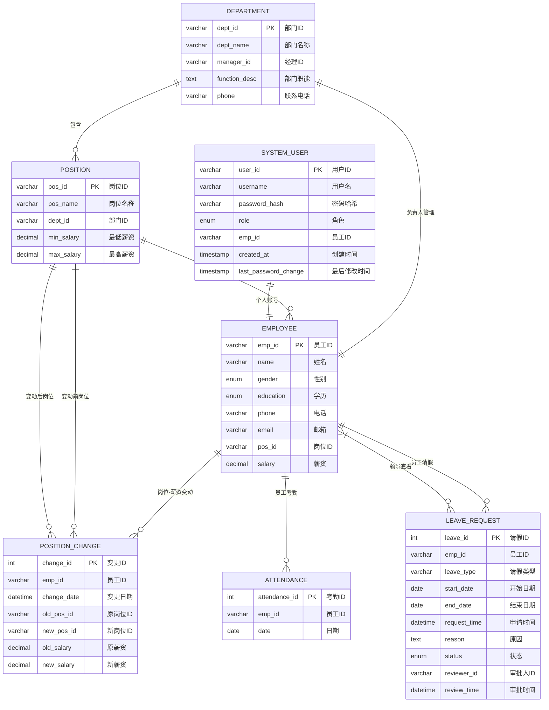

```mermaid
erDiagram
    %% 实体关系定义
    DEPARTMENT ||--o{ POSITION : "包含"
    DEPARTMENT ||--|| EMPLOYEE : "负责人管理"
    POSITION ||--o{ EMPLOYEE : "任职"
    SYSTEM_USER ||--|| EMPLOYEE : "个人账号"
    EMPLOYEE ||--o{ POSITION_CHANGE : "岗位-薪资变动"
    EMPLOYEE ||--o{ ATTENDANCE : "员工考勤"
    EMPLOYEE ||--o{ LEAVE_REQUEST : "员工请假"
    EMPLOYEE }|--o{ LEAVE_REQUEST : "领导查看"
    POSITION ||--o{ POSITION_CHANGE : "变动前岗位"
    POSITION ||--o{ POSITION_CHANGE : "变动后岗位"

    %% 实体属性定义
    DEPARTMENT {
        varchar dept_id PK "部门ID"
        varchar dept_name "部门名称"
        varchar manager_id "经理ID"
        text function_desc "部门职能"
        varchar phone "联系电话"
    }

    POSITION {
        varchar pos_id PK "岗位ID"
        varchar pos_name "岗位名称"
        varchar dept_id "部门ID"
        decimal min_salary "最低薪资"
        decimal max_salary "最高薪资"
    }

    EMPLOYEE {
        varchar emp_id PK "员工ID"
        varchar name "姓名"
        enum gender "性别"
        enum education "学历"
        varchar phone "电话"
        varchar email "邮箱"
        varchar pos_id "岗位ID"
        decimal salary "薪资"
    }

    SYSTEM_USER {
        varchar user_id PK "用户ID"
        varchar username "用户名"
        varchar password_hash "密码哈希"
        enum role "角色"
        varchar emp_id "员工ID"
        timestamp created_at "创建时间"
        timestamp last_password_change "最后修改时间"
    }

    POSITION_CHANGE {
        int change_id PK "变更ID"
        varchar emp_id "员工ID"
        datetime change_date "变更日期"
        varchar old_pos_id "原岗位ID"
        varchar new_pos_id "新岗位ID"
        decimal old_salary "原薪资"
        decimal new_salary "新薪资"
    }

    ATTENDANCE {
        int attendance_id PK "考勤ID"
        varchar emp_id "员工ID"
        date date "日期"
    }

    LEAVE_REQUEST {
        int leave_id PK "请假ID"
        varchar emp_id "员工ID"
        varchar leave_type "请假类型"
        date start_date "开始日期"
        date end_date "结束日期"
        datetime request_time "申请时间"
        text reason "原因"
        enum status "状态"
        varchar reviewer_id "审批人ID"
        datetime review_time "审批时间"
    }
```